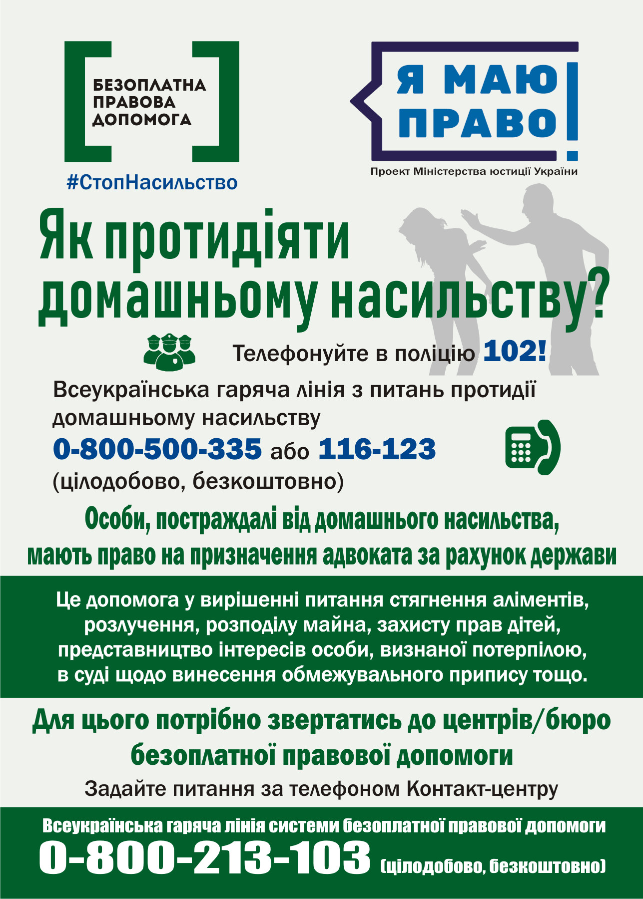
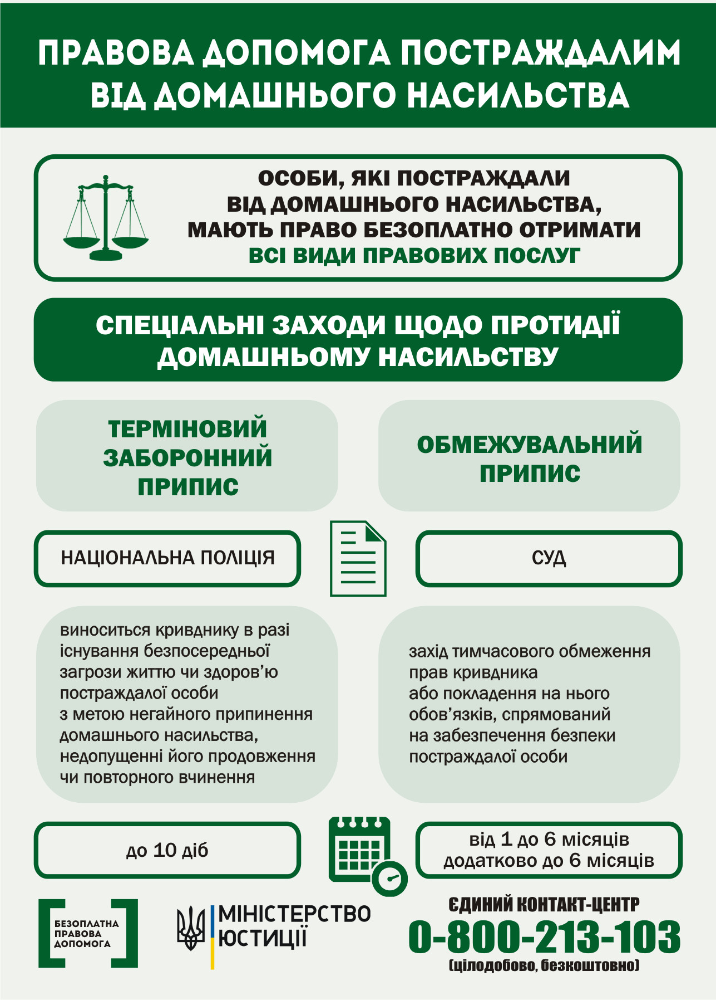
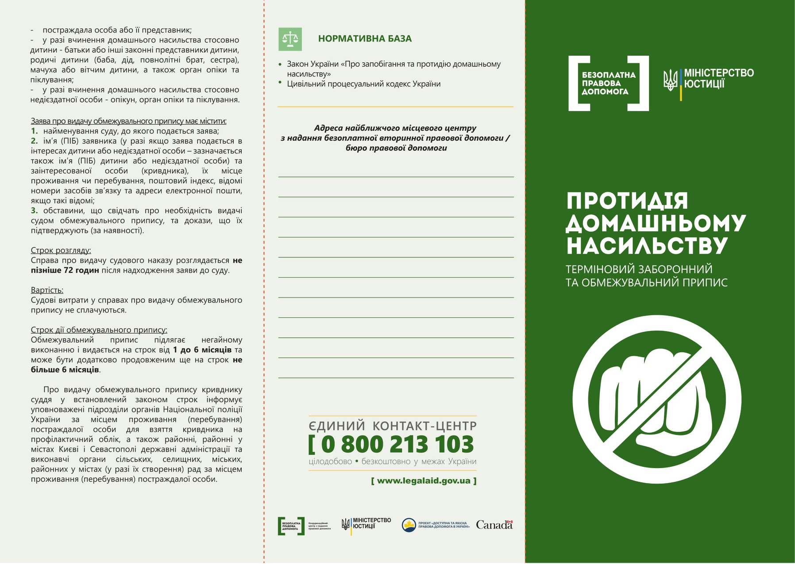
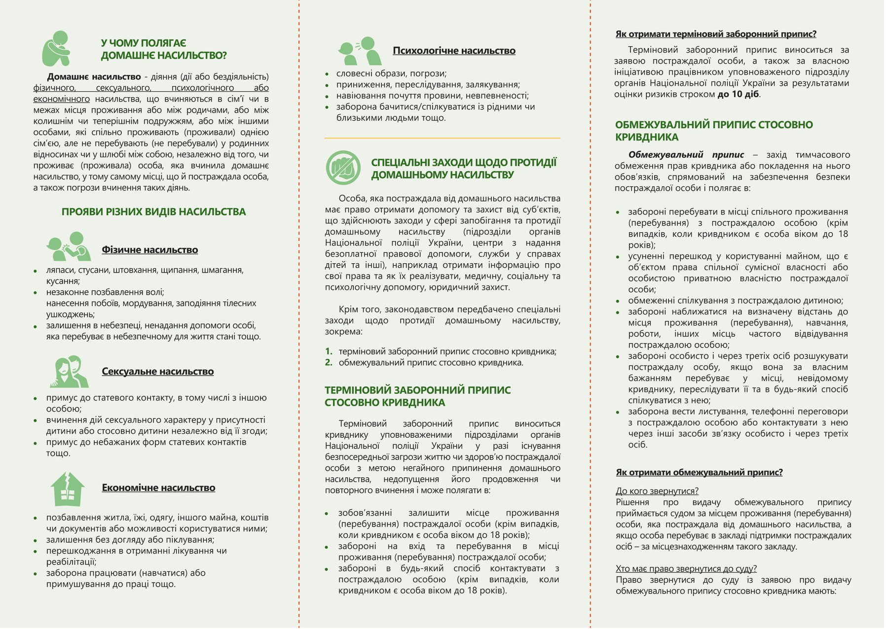

---
title: Попередження домашнього насильства
---

**Куди звертатись у випадку домашнього насильства?**

1547 - урядова лінія з протидії насильству;  
116123 або 0-800-500-335 - національна гаряча лінія ГО "ЛаСтрада"  
0-800-213-103 - контакт-центр системи безоплатної правової допомоги  
102- поліція

**Що робити, якщо ви тривалий час страждаєте від насильства, але до поліції ви ще не готові звертатись?**

Вам потрібна підтримка і допомога, у тому числі психологічна. Для цього працюють центри соціальних служб для сім'ї, дітей та молоді, а координують допомогу постраждалим від домашнього насильства структурні підрозділи при органах місцевої влади (відділи у справах сім'ї або структурні підрозділи соціального захисту).

**Юридична допомога**

Пам’ятайте, особи, постраждалі від домашнього насильства, мають право на призначення адвоката/юриста за рахунок держави.  
Тож ви можете звертатись у Криворізький місцевий центр з надання безоплатної вторинної правової допомоги!

**Наші адреси:**
м.Кривий Ріг: вул.Качалова, 2,
тел.098-040-83-70;
вул.Героїв АТО, 30
тел.097- 139-88-57;
вул.Станіслава Конткевича, 37,
тел.067-276-54-76;
пр.Перемоги, 33а (ж-м Інгулець),
тел.067-118-34-90;

Особи, які постраждали від домашнього насильства, можуть отримати допомогу юристів для стягнення аліментів, розлучення, розподілу майна, представництва інтересів як потерпілої в кримінальній справі.

**Телеграм-чати для підтримки осіб, які страждають від домашнього насильства:**

Телеграм-чат «Правова допомога протидії насильству» https://t.me/Non_Violence_Bot  
Чат-бот #ДійПротиНасильства [https://t.me/police_helpbot](https://t.me/police_helpbot)  
Якщо ви страждаєте від насильства, не мовчіть! Звертайтесь за допомогою!

<youtube id="2o3JbtG4kn8"></youtube>

