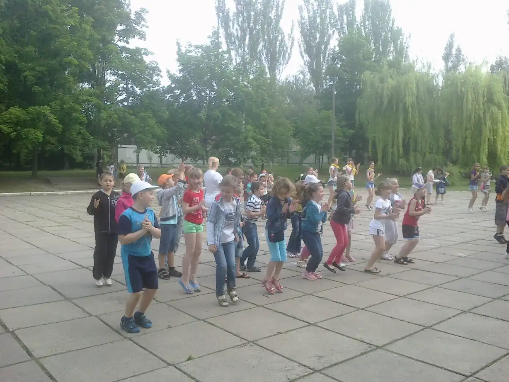
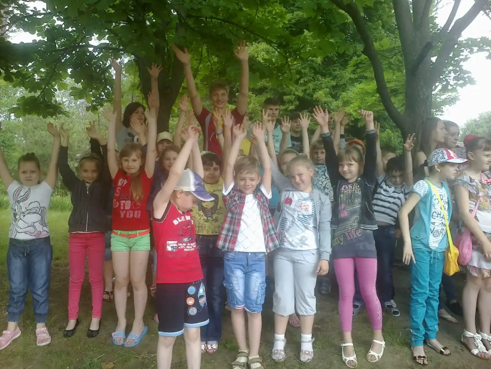
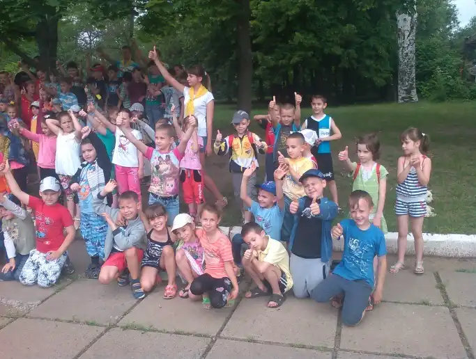
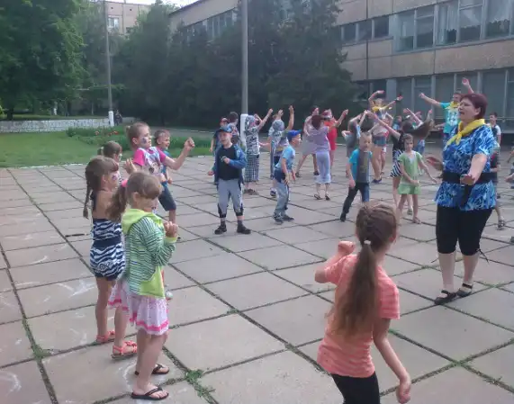

# Дитячий табір «Веселка» з денним перебуванням при КЗШ І – ІІІ ст. № 55 (з 02.06.2014 по 16.07.2014)

## Планета нових знайомств. Святковий парад планет

-   Відкриття табірної зміни.
-   Вивчення загонових і табірної пісень. Презентація загонів «Давайте знайомитися!»
-   Конкурс малюнків на асфальті «Світ очима дітей».
-   Пісенне коло.
-   Організація роботи прес-центру.

В КЗШ № 55 відбулося відкриття табору “Веселка”. До дитячого закладу відпочинку завітало 142 учні. Кожен загін підготував захист свого загону (назви, девізу, емблеми, речівки).

Вожаті (лідери школи) протягом дня розучували з дітьми кричалки, танцювали та проводили цікаві ігри.

<slideshow id="72157648764657160"></slideshow>

Основним напрямом роботи табору формування здорового способу життя, тому з вихованцями загону «Сонечко» проводились бесіди: «Хвороби брудних рук», «Правила здорового харчування», «Культура поведінки за столом», екологічний практикум «Школа добрих чарівників» (виготовлення поробок з використаних коробок, пластикових пляшок, газет і т. ін.). Активну участь приймав загін у спортивній олімпіаді. Весело і з захопленням діти змагались, вболівали, раділи перемогам.

Життя дітей у таборі проходило цікаво і змістовно. Було організовано і проведено велику кількість конкурсів, змагань, розважальних програм, ігор, екскурсій,вікторин і т. ін. Загін «Сонечко» із задоволенням взяв участь у конкурсах «Веселі гримери», «Містечко веселих майстрів», в яких діти розвивали свою творчу уяву, фантазію, образне мислення, спостережливість.

В перший день діти вивчали назви загонів, девізи, речівки. Після цього учні прийняли участь у концерті, присвяченому відкриттю табірної зміни. Представники 3 загону представили танок «Недитячий час».

Вихователі ознайомили дітей із режимом роботи табору , бесіди із техніки безпеки.

Проведено святковий концерт присвячений відкриттю табірної зміни та Дню захисту дітей. Діти брали участь у конкурсах , співали та танцювали.

Також проведено педагогічно- організаційну роботу в загонах . Розучено девізи , виготовлено емблеми , оформлено загонові куточки . Презентація загонів «Давайте знайомитися!».

Вихователі ознайомили дітей із режимом роботи табору, бесіди із техніки безпеки.

