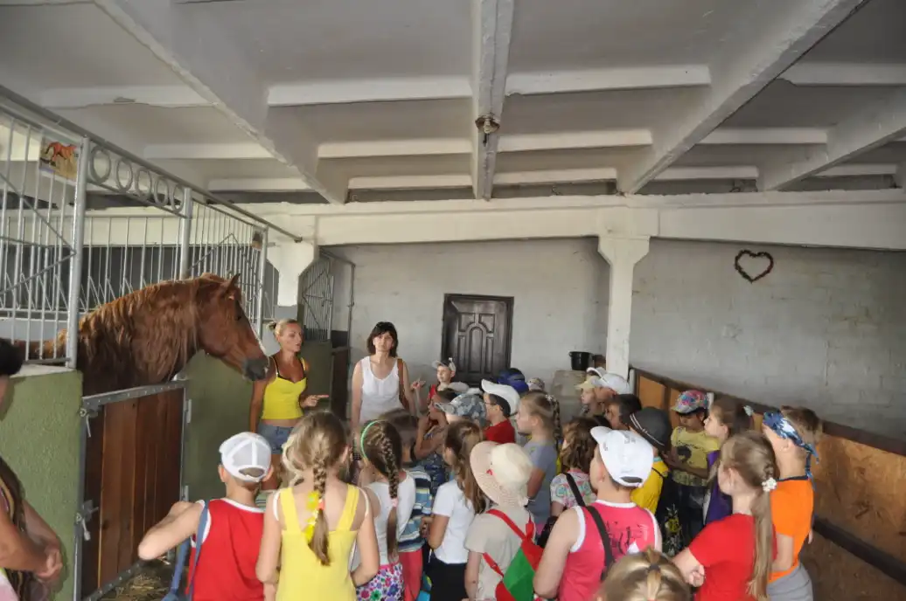
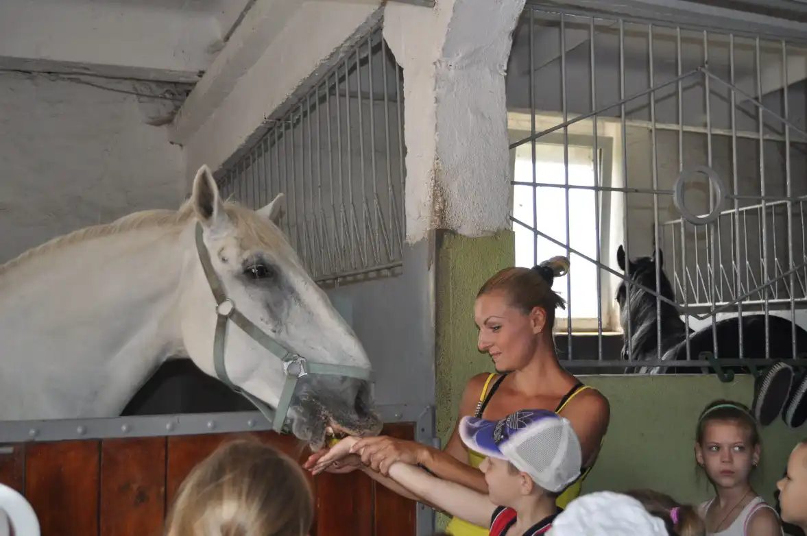
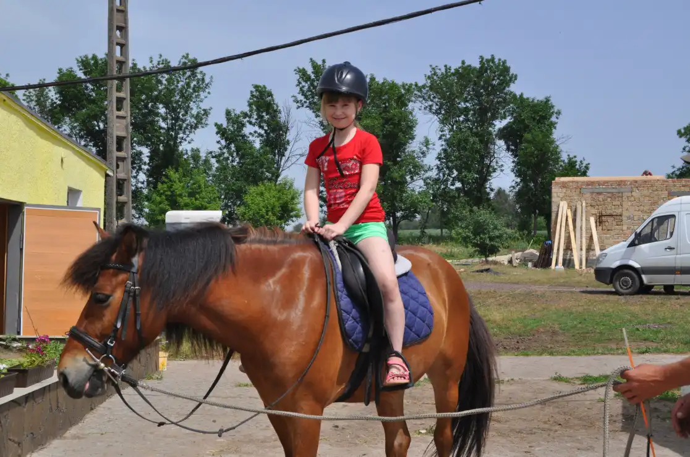
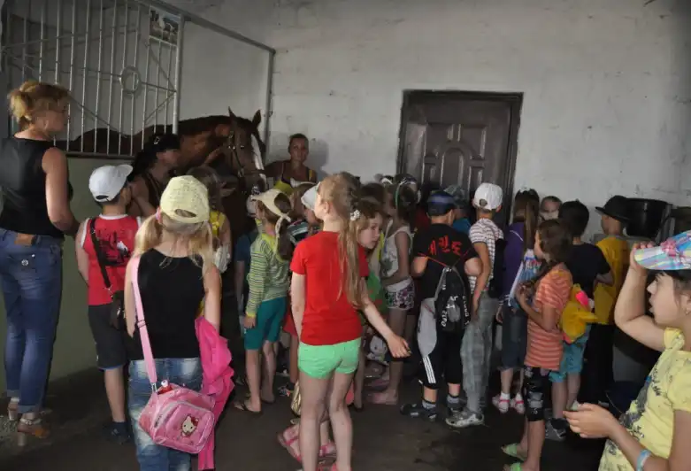
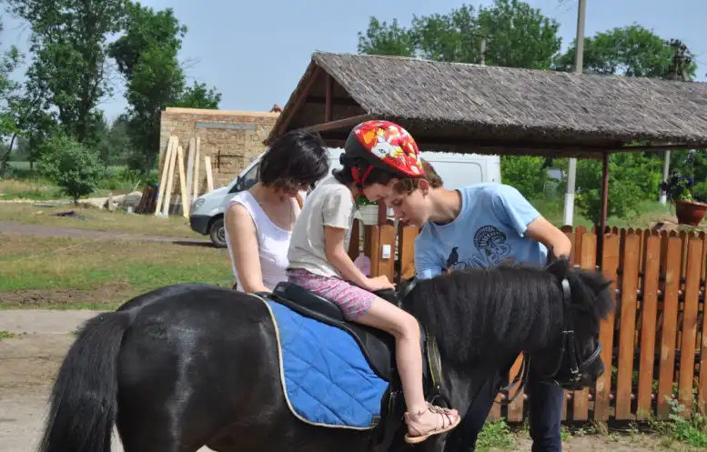
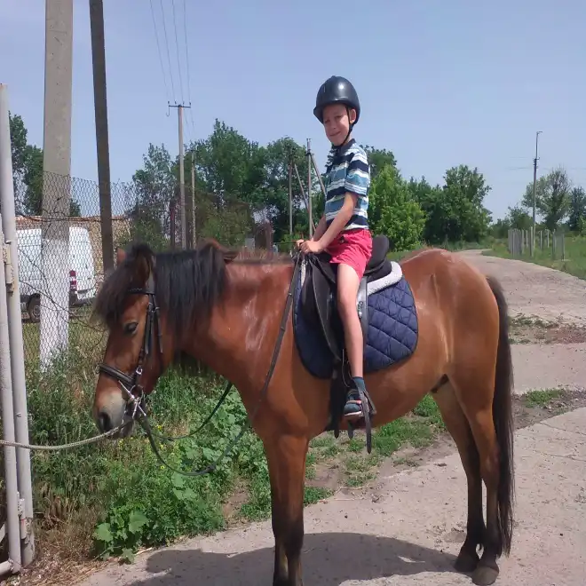
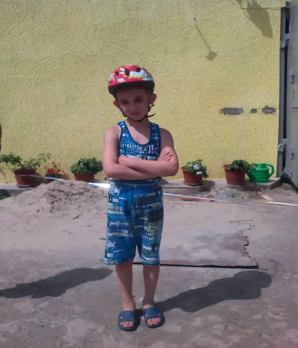

# Дитячий табір «Веселка» з денним перебуванням при КЗШ І – ІІІ ст. № 55 (з 02.06.2014 по 16.07.2014)

## Космічні старти

-   Малі Олімпійські ігри.
-   Спортивні естафети.
-   Веселий футбол.
-   Незвичайна дискотека.

В дитячому шкільному таборі “Веселка” відбулося спортивне свято під девизом “Спорт - це здоров’я і сила”. Діти із задоволенням стрибали через скакалки, грали у волейбол і баскетбол, приймали участь у рухливих спортивних іграх.

Всі були буде задоволені проведенням такого заходу. А нагородою були солодкі призи, зміцнення здоров’я і гарний настрій у всіх.

<slideshow id="72157648766145688"></slideshow>

I загін «Сонечко» літнього шкільного табору «Веселка» побував на екскурсії в дитячій бібліотеці. В читальному залі діти оглянули куточок, присвячений 69-й річниці Великої Вітчизняної війни, де представлені фото ветеранів, листи бійців з фронту та інші експонати. Із захопленням слухали діти розповідь бібліотекаря про ветеранів Великої Вітчизняної війни, які захищали рідне місто в роки війни.

Цікаво і весело пройшла вікторина «Сторінками улюблених казок» та ігри, розваги.

<slideshow id="72157646846153613"></slideshow>

Сьогодні представники 3 загону не тільки прийняли участь у різноманітних спортивних змаганнях, а й відвідали місцеву конеферму. Спочатку дітям була проведена екскурсія, де вони познайомилися з кожним мешканцем ферми.

Бажаючі могли погодувати коней.

Але найбільше сподобалося дітям їздити верхи.

**Про коня**

<pre>
Наснивсь мені сон про коня,
Ніби я іду навмання,
А у лісі страшенно,
Вітер віє шалено,
А я впевнено далі іду.
Тишу порушено,
дивлюся зворушено,
Я на того коня.
Він чудовий стрункий і умілий,
А грива м’яка та красива.
Осідлала я того коня,
Й поскакали ми разом в дива…
</pre>

Це був день спілкування і єднання з природою.

