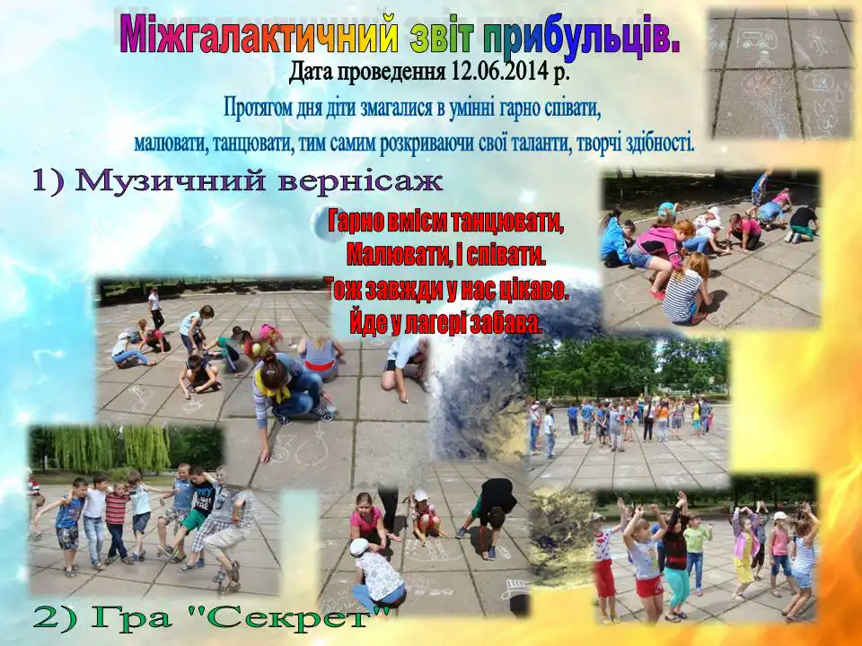
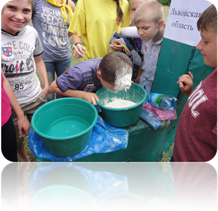
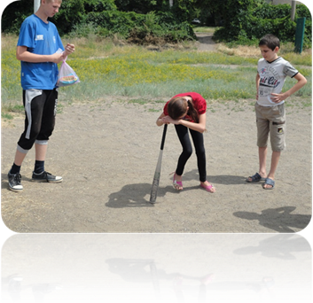
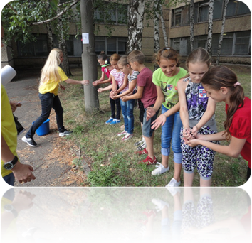
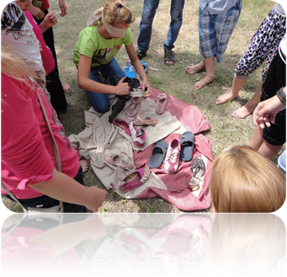

# Дитячий табір «Веселка» з денним перебуванням при КЗШ І – ІІІ ст. № 55 (з 02.06.2014 по 16.07.2014)

## Між галактичний зліт прибульців

-   Музичний вернісаж.
-   Гра «Секрет».
-   Бесіда «Один за всіх і всі за одного».

<slideshow id="72157648765493778"></slideshow>

Діти ІІ загону вміють не лише співати й танцювати. 12 червня вони зайняли І місце у спортивних змаганнях, проведених у формі естафети. Всі учні приймали активну участь на всіх станціях естафети, вболівали за своїх товаришів.

<slideshow id="72157648763899480"></slideshow>

Це стародавнє мистецтво з Японії захопило нас на цілий день. Дивно, але звичайний папір надає такі можливості: розповісти другові казку, одягнути подругу, прикрасити будинок.

<gallery>

</gallery>
