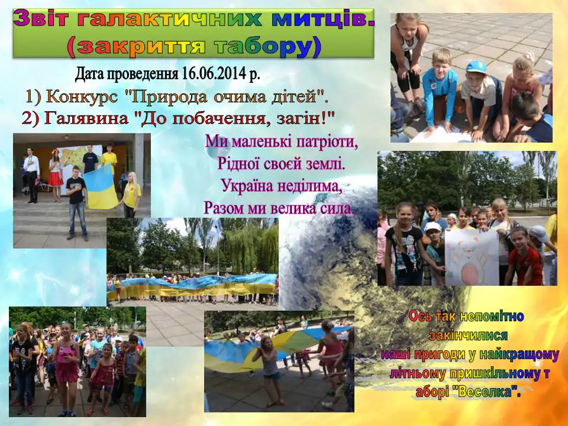
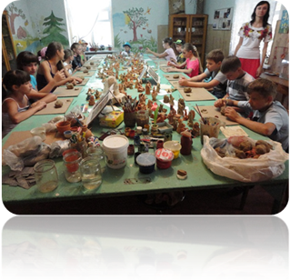
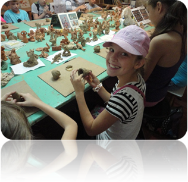
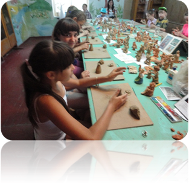
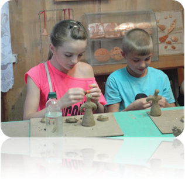
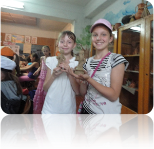

# Дитячий табір «Веселка» з денним перебуванням при КЗШ І – ІІІ ст. № 55 (з 02.06.2014 по 16.07.2014)

## Закриття табору. Зліт галактичних митців

-   Конкурс «Природа очима дітей» (конкурс екібани, картин з природного матеріалу)
-   Виставка «Град веселих майстрів».
-   Конкурс поробок.
-   Свято творчих майстрів (кулінари, художники, перукарі)
-   Галявина «До побачення, загін!»
-   Великий концерт.
-   Закриття табору.

<slideshow id="72157649109639486"></slideshow>

Сьогодні ми були справжніми чарівниками, адже оживляли своїми руками звичайну глину!

<gallery>

</gallery>
