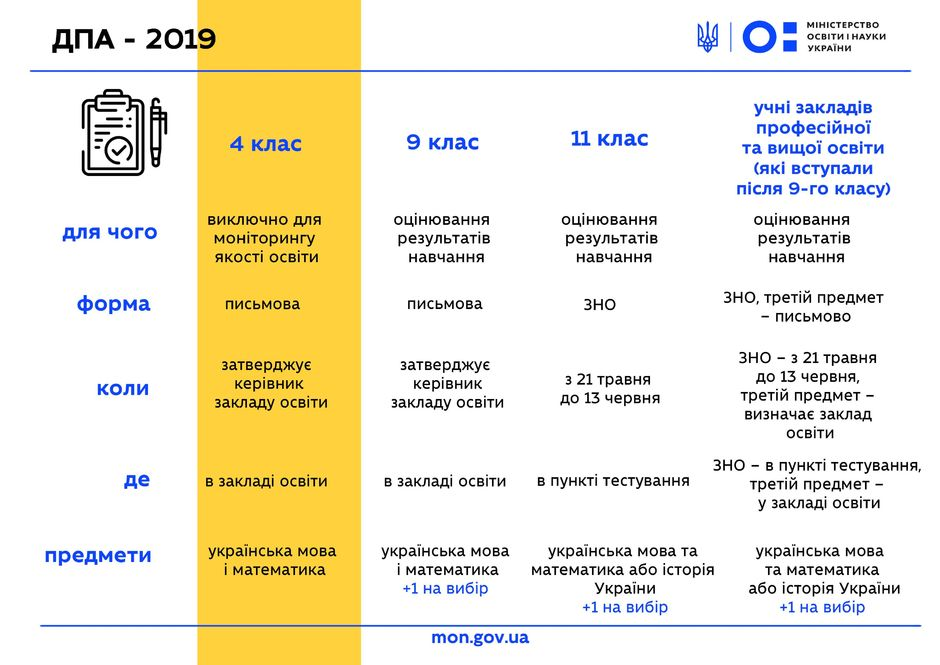

**На 2019 рік МОН розширило можливості учнів під час проходження державної підсумкової атестації. Це, насамперед, стосується зарахування сертифікатів міжнародних мовних іспитів, проходження атестації тими, хто перебуває в СІЗО, та перескладання ДПА учнями коледжів і технікумів. Новий [Порядок проведення державної підсумкової атестації був затверджений наказом МОН](https://pedpresa.ua/goto/https://mon.gov.ua/ua/npa/pro-zatverdzhennya-poryadku-provedennya-derzhavnoyi-pidsumkovoyi-atestaciyi-1369?fbclid=IwAR2gu-J6tX2Ba9RK9_i5gKlbSp4a44JNSfgRnkX9n_ATY12gJgXBJ1UpoN8) та набув чинності сьогодні, 25 січня 2019 року.**

Серед основних змін – відтепер зараховувати як оцінку за ДПА сертифікати або дипломи міжнародного мовного іспиту з іноземної мови зможуть не тільки учні 11-х класів, а й 9-х. Зокрема, 12 балів мають змогу отримати:

- учні 9-х класів у разі наявності сертифіката або диплома, що підтверджує рівень володіння мовою А2 і вище, а для класів із поглибленим вивченням – В1 і вище;
- учні 11(12)-х класів у разі наявності сертифіката або диплома, що підтверджує рівень володіння мовою В1 і вище, а для класів із поглибленим вивченням – В2 і вище.

Право проходити ДПА отримали учні, які перебувають у слідчих ізоляторах під час досудового слідства. У цьому випадку проведення атестації забезпечуватиме закріплений за СІЗО заклад освіти.

Перескласти цього року ДПА в формі ЗНО зможуть студенти ОКР «Молодший спеціаліст», що 2018-го отримали незадовільну оцінку за результатами атестації (1-3 бали). Мова про тих, хто після 9-го класу отримує фах у закладі професійної або вищої освіти і одночасно закінчує здобуття повної загальної середньої освіти. Торік такі студенти вперше складали ДПА в формі ЗНО з української мови.

У Порядок також закладені зміни, що почнуть діяти з 1 січня 2021 року. Це обов’язкове проходження ДПА у формі ЗНО з математики для тих, хто отримує повну загальну середню освіту. Тобто випускників 11-х класів, а також учнів закладів профосвіти та студентів закладів вищої освіти, що вступали на базі 9-ти класів.

Загалом же державну підсумкову атестацію цього року складатимуть:

1. учні 4-х класів. ДПА проводиться виключно для моніторингу якості освіти і жодним чином не впливає на оцінювання результатів навчання учня. Проходить в письмові формі в закладі освіти. Терміни затверджує керівник закладу освіти в межах навчального року. Обов’язковою є атестація з української мови та математики;

2. учні 9-х класів. ДПА проводиться в письмовій формі в закладі освіти. Терміни затверджує керівник закладу освіти в межах навчального року. Обов’язковою є атестація з української мови та математики. Третій предмет – за вибором учня з переліку, який щороку затверджується МОН;

3. учні 11(12)-х класів. ДПА проводиться в формі зовнішнього незалежного оцінювання з 3 предметів: перший – українська мова, другий – математика або історія України, третій – на вибір учня. Проходить в пункті тестування. Терміни затверджує МОН

4. учні та студенти, що здобувають ОКР «молодший спеціаліст» або професійну освіту одночасно з отриманням повної загальної середньої освіти (вступ на базі 9-ти класів). Складають ДПА з 3 предметів: 2 у формі ЗНО (українська мова та математика або історія України) у пункті тестування, третій письмово в закладі освіти. Терміни ЗНО затверджує МОН, третього предмета – заклад освіти.

У Порядку також передбачено, що учні, які проживають на тимчасово окупованих територіях Криму та Донбасу чи лінії зіткнення і не здобувають загальну середню освіту в школах на підконтрольній Україні території, можуть пройти атестацію екстерном у закладах освіти, рекомендованих органами управління у сфері освіти. Окрім цього такі учні можуть пройти атестацію в межах спрощеного вступу через освітні центри «Крим-Україна» та «Донбас-Україна».

[Державна підсумкова атестація для учнів 9-х класів не проходитиме за технологією ЗНО, її планують впровадити не раніше 2027 року.](https://pedpresa.ua/goto/https://mon.gov.ua/ua/news/cogorich-uchni-9-h-klasiv-ne-zdavatimut-derzhavnu-pidsumkovu-atestaciyu-za-tehnologiyeyu-zno-rozyasnennya-mon)

