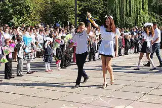
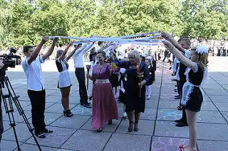
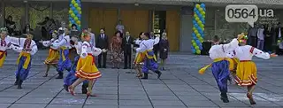

1 вересня в КЗШ I-III ст. № 55 пролунав перший дзвінок для 52 учнів. На святі були присутні почесні гості: Голова Дніпропетровської обласної державної адміністрації Дмитро Валерійович Колєсніков, який закінчив КЗШ № 55, директор Департаменту освіти і науки Дніпропетровської обласної державної адміністрації Олександр Ігорович Демчик, заступник міського голови Валентина Миколаївна Бєрлін, начальник управління освіти і науки виконккому Криворізької міської ради Наталія Олександрівна Касимова, голова Тернівської районної в місті ради Володимир Петрович Терьохін, начальник відділу освіти виконкому Тернівської районної в місті ради Сергій Олександрович Горевич.

Губернатор Дніпропетровської області привітав педагогічний колектив, учнів, батьків зі святом. “Світ для вас відкритий. Головне - вірити в себе і в свої сили”, - підкреслив Д. Колєсніков. Школа одержала у подарунок компь’ютерну техніку та сертифікат на отримання шкільних меблів.

<gallery>

</gallery>
