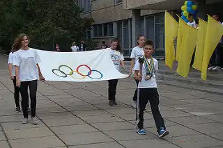
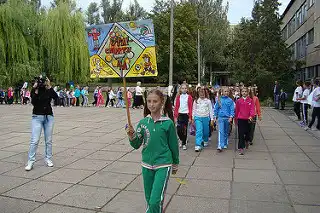
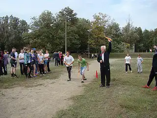
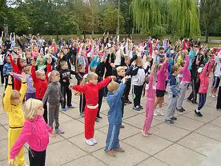

В КЗШ I-III ст. №55 відбувся День фізичної культури і спорту.

Ранок всіх учнів розпочався з Єдиної ранкової зарядки на подвір’ї школи, після якої діти пішли до затишних класів на Всеукраїнський Олімпійський урок “Історія - є. Майбутнє - твоє”. О 12 годині відбулася Спартакіада, на яку вихованці школи приготували девіз, емблему, стройову пісню тощо.

Учні 2-4 класів активно приймали участь у Веселих Стартах. Для дітей 5-8 класів було організовано різноманітні спортивні конкурси, естафети.
Старшокласники мали змогу позмагатися в іграх з волейболу та футболу. Діти пішли додому з гарним настроєм та незабутніми враженнями.

<gallery>

</gallery>
