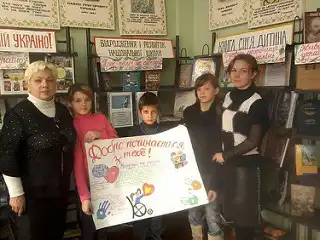

До Дня інваліда, для учнів 5 класів проведено тренінг “Добро починається з тебе”, метою якого стало виховання гуманного відношення до людей з проблемами здоров’я. Одним з завдань учнів було намалювати газету за даною тематикою.

