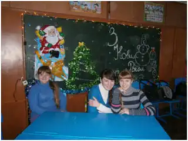
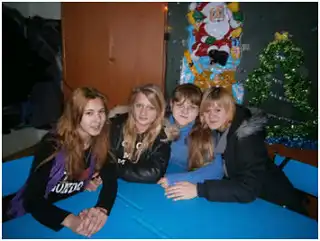

У 9-А класі було проведено захід «Новорічна конкурсна програма». Учні класу з задоволенням приймали участь у цьому заході. У конкурсній програмі змагалися три команди, які продемонстрували свою ерудицію, кругозір, дотепність, спритність та вміння діяти креативно в нестандартних ситуаціях. Перемогла, звичайно, дружба, а головним призом став веселий новорічний настрій!

