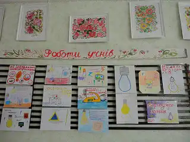

З 6 по 9 жовтня в КЗШ № 55 були проведені уроки з образотворчого мистецтва для учнів 5-7 класів по темі “Енергозбереження”. Результати учнівськіх робіт були представлені на виставці в кабінеті образотворчого мистецтва.

