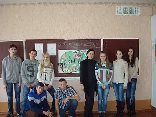
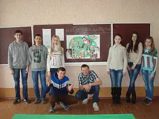

в 9 – Б класі відбувся круглий стіл з теми: «Моє майбутнє…», де відбулося спільне обговорення виступу «Формула успіху всередині нас». Спільними зусиллями учні дійшли висновку, що успішна людина живе так, як хоче сама. Для цього треба багато чого навчитися: здобувати знання і бути обізнаним у різних сферах діяльності, цікавитися різними галузями і новими досягненнями у цих галузях, уміти застосовувати вміння і знання з користю для себе і для інших. А головне – знайти себе… Наприкінці учні 9 – го класу власними зусиллями зробили колаж на запропоновану тему, головне гасло якого «Учись жити – життя цікаве, якщо його розгледіти!»

