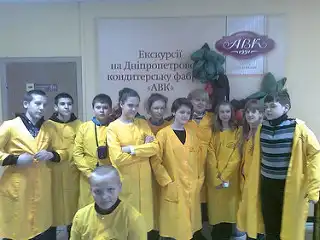
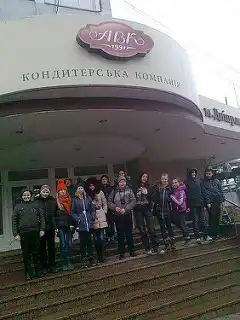
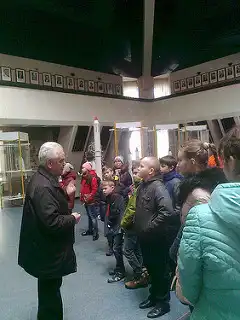
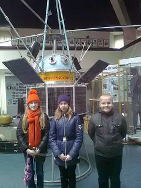
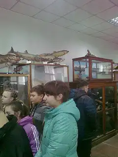
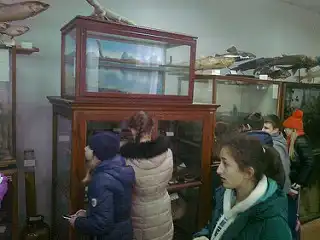

Учні 7-Б відвідали шоколадну майстерню «АВК» і на власні очі побачили, як створюються шедеври з цього солодкого матеріалу. Кондитерська компанія «АВК» - це перша компанія в Україні, яка почала виробляти шоколад з какао-бобів.

У музеї Космонавтики представлена експозиція історії розвитку космосу. Дітям сподобалася демонстрація космічних станцій, супутників.

Цікавою була екскурсія до Зоологічного музею ДНУ імені Олеся Гончара, який створений у 1924 році на основі експонатів із Краєзнавчого музею (зараз історичний музей ім. Д. І. Яворницького). Сьогодні зоологічний музей є науково-навчальним, культурно-освітнім, виховним та природоохоронним підрозділом ДНУ імені Олеся Гончара. Головною метою музею є вивчення рідкісних і типових видів місцевої та світової фауни шляхом створення, поновлення та збереження зоологічних колекцій, ведення наукової, навчальної та освітньої роботи.

