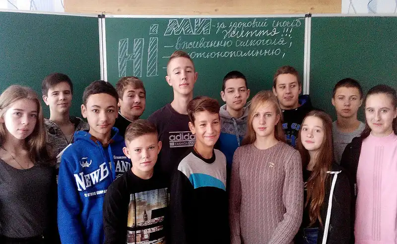

Для кожної людини найголовніше – це здоров’я.

04.11.2016р. у КЗШ І-ІІІ ст. № 55 для учнів 1-2 класів було проведено виховну годину на тему «Техніка безпеки. Режим дня».

Діти оновили знання про поняття «режим дня», основні режимні моменти. Увага була зосереджена на необхідності дотримання режиму, розвитку санітарно-гігієнічних навичок, вихованню акуратності, організованості, працьовитості.

Школярам було запропоновано прослухати казку, вірші, розглянути ситуативні моменти, погратися в рольові ігри, подивитися тематичний відеоматеріал.

Учні прийшли до висновку, що дотримання режиму дня необхідно для збереження здоров’я.

<slideshow id="72157674947701440"></slideshow>

Людина стає окрасою товариства лише тоді, коли згоджує свої наміри та вчинки з певними правилами, з правилами особистої гігієни.

В 3 класах пройшла виховна година на тему «Особиста гігієна – запорука здоров’я». Під час заходу діти ознайомилися із поняттям «гігієна», в ігровій формі повторили засоби особистої гігієни. Працюючи в групах, склали правила особистої гігієни для учнів класу. Всі діти переконалися, що необхідно виконувати елементарні санітарно-гігієнічні навички, для збереження власного здоров’я. Адже дуже часто саме від охайності людини залежить вирішення багатьох важливих справ.

<slideshow id="72157676028342386"></slideshow>

У 4 класах пройшла єдина виховна година «Техніка безпеки під час навчально-виховного процесу. Особиста гігієна». Діти повторили правила техніки безпеки під час навчально-виховного процесу. Група учнів підготували розповідь про гігієну та ознайомили з правилами догляду за шкірою, зубами, волоссям, вухами. Школярі вивчили ряд вправ для загартовування. Протягом роботи у трійках дітлахи визначили предмети для особистої гігієни, а потім показали сценку про мандри бруднулі.

Захід допоміг школярам пригадати правила особистої гігієни.

<slideshow id="72157674685331881"></slideshow>

Більше як 80% інформації про навколишній світ людина дістає за допомогою органа зору – ока. Зір необхідний майже в усіх видах діяльності. Значна роль його і для розвитку просторових уявлень, удосконалення рухових реакцій. Правильне функціонування органа зору особливо важливе для нормального розвитку дитини.

У 6 класах була проведена виховна година на тему «Гігієна органів зору. Очі – вікна в світ», під час якої поглибили знання про орган зору – око, вчилися правильно доглядати за очима. У цікавій ігровій формі учні навчились розрізняти, що корисно, що шкідливо для очей, вивчили і закріпили вправи для профілактики захворювань та зняття втоми очей, що необхідно робити, якщо в око потрапив сторонній предмет. Шестикласники брали активну участь в обговоренні проблеми збереження зору.

<slideshow id="72157676126474925"></slideshow>

У 7 класах було проведено виховну годину на тему «Безпека власного життя. Запобігання інфекційних хвороб. Здоровий спосіб життя». Було висвітлено про основні складові здоров’я, пояснено, яким чином дотримуватися здорового способу життя, застерігати про небезпеку, що чатує на неуважних до власного здоров’я школярів.

Діти підготували повідомлення з теми «Бережи своє здоров’я», розповіли про режим дня, правильне харчування та користь фізичних вправ для підлітків.

<slideshow id="72157676126262495"></slideshow>

«Твоє майбутнє в твоїх руках» - тема пізнавальної та актуальної виховної години, яка була проведена у 8 класах. Діти працювали у формі рольової гри. Завдяки «статистам», «біологам», «хімікам», «лікарям», «всезнайкам» та «доктором медицини» діти дійшли висновку, що тютюн, алкоголь та наркотики згубно впливають на здоров’я та життя підлітків. Завдяки роботі в «наукових групах» були створені агітаційні плакати. Школярам вирішили, що потрібно вести здоровий спосіб життя та застерігати своїх ровесників від шкідливих звичок.

<slideshow id="72157674685702821"></slideshow>

З метою розширення знань про негативні наслідки тютюнопаління, вживання алкогольних напоїв, наркотичних речовин у 9-А класі було проведено виховну годину "Геть наркотики! Геть алкоголь! Геть тютюнопаління! Ми - здорове покоління!". Ефект і результат заходу - дітей залучено до боротьби за звільнення довкілля від тютюнового диму, алкоголю, наркоманії, заохочено до здорового способу життя. Старшокласники свідомо засудили тих, хто палить, п’є, вживає наркотики та рекламує це!

