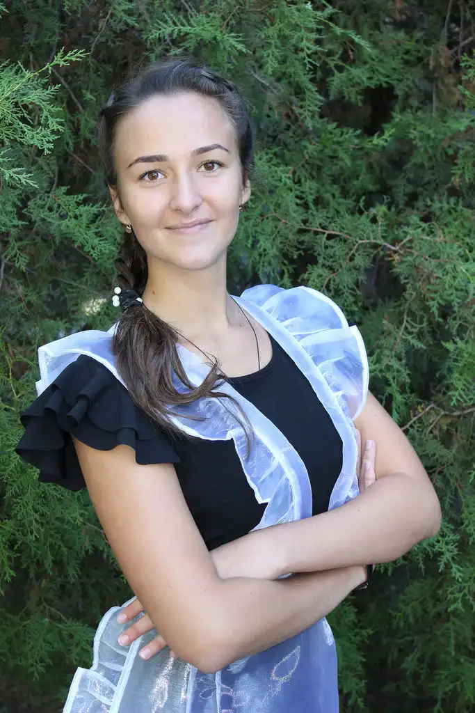

Вітаємо ученицю 11-А класу Рой Діану за перемогу в районному етапі обласного конкурсу творчості юних журналістів «Юнтелепрес», учасники якого досліджували питання «Чи важко бути дитиною в ХХІ столітті?»

Серед юних журналістів шкільних прес-центрів району було представлено на міський етап обласного конкурсу 12 журналістських досліджень, із яких 8 робіт стали переможцями.

Найкращою журналістською інформацією для друкованих засобів масової інформації визнано роботу Рой Діани, яка ввійшла до фінального етапу обласного конкурсу творчості юних журналістів «Юнтелепрес».

