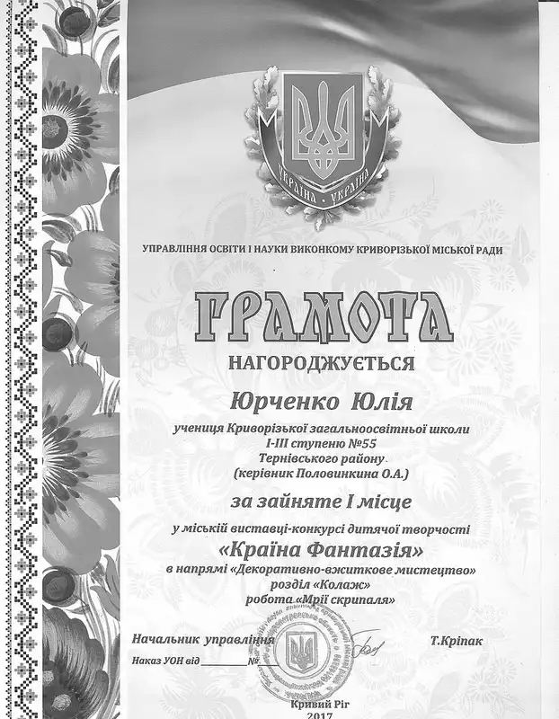

Згідно наказу виконкому Криворізької міської ради управління освіти і науки від 30.01.2017 №48 03.02.2017 у КЗШ І-ІІІ ст.№55 було проведено шкільний відбірковий етап міської виставки-конкурсу дитячої творчості «Країна Фантазії». Роботи, які відібрало журі, направлено на І етап (районний відбірковий етап).

До конкурсу долучилися учнівські колективи наступних класів: 1-А (кл. керівник Фербей В.М.), 1-Б (кл. керівник Заярнюк С.А.), 2-А (кл. керівник Довмат Г.В.), 2-Б (кл. керівник Лисенко О.Б), 3-А (кл. керівник Мугак Н.І.), 3-Б (кл. керівник Половинкина О.А.), 4-А (кл. керівник Юшко А.А.), 4-Б (кл. керівник Старікова Н.А.), 5-Б (кл. керівник Люльченко О.Г.), 7-Б (кл. керівник Іванова І.М.). Роботи, надані на участь у конкурсі, відображають музичні інструменти, нотні знаки, образи музичних творів, зразки народного фольклору; є оригінальними за змістом, формою та кольором; мають естетичне оформлення.

Вітаємо переможицю міської виставки–конкурсу дитячої творчості «Країна Фантазії» Юрченко Юлію, ученицю 3-Б класу (керівник Половинкина О. А.), за зайняте перше місце у молодшій групі вікової категорії.

<slideshow id="72157680911882785"></slideshow>
