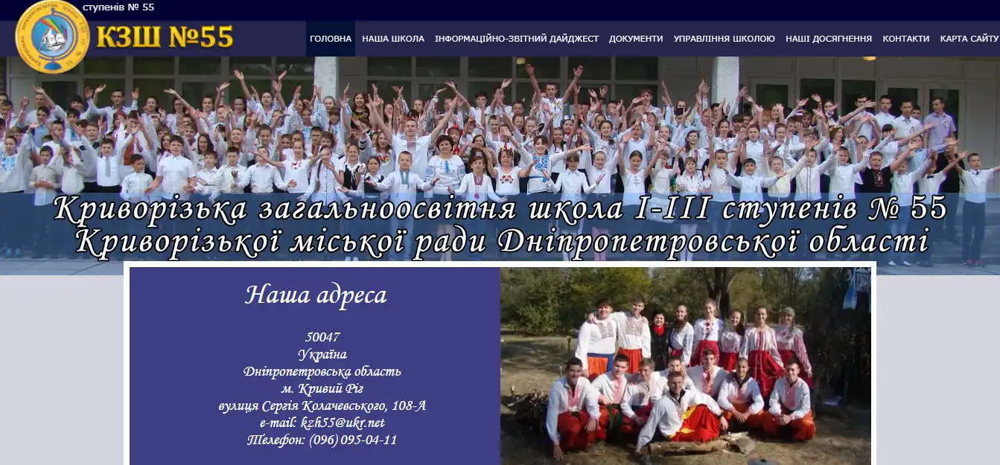

23.01.2018 на базі Криворізької педагогічної гімназії відбувся міський конкурс на кращий сайт закладу освіти. У конкурсі взяли участь 56 сайтів від 7 районів міста, серед яких:

-   3 сайти закладів загальної середньої освіти (ЗЗСО) І, І-ІІ ступенів,
-   31 сайти закладів загальної середньої освіти (ЗЗСО) І-ІІІ ступеня,
-   13 сайтів закладів загальної середньої освіти (ЗЗСО) нового типу (ліцеїв, гімназій, навчально-виховних комплексів, спеціалізованих шкіл),

-   6 сайтів закладів дошкільної освіти (ЗДО),
-   3 сайти закладів позашкільної освіти (ЗПО).

Відповідно до положення про конкурс, члени журі оцінювали дизайн сайту, інформаційне наповнення (контент), зручність, динамічність та технічні показники сайту.

Сайт Криворізької загальноосвітньої школи І-ІІІ ст.№55 отримав перемогу та посів **ІІ місце** в номінації «Web-сайт ЗЗСО І-ІІІ ступенів».

Вітаємо переможців конкурсу та бажаємо подальших успіхів у розвитку Інтернет-середовища.

