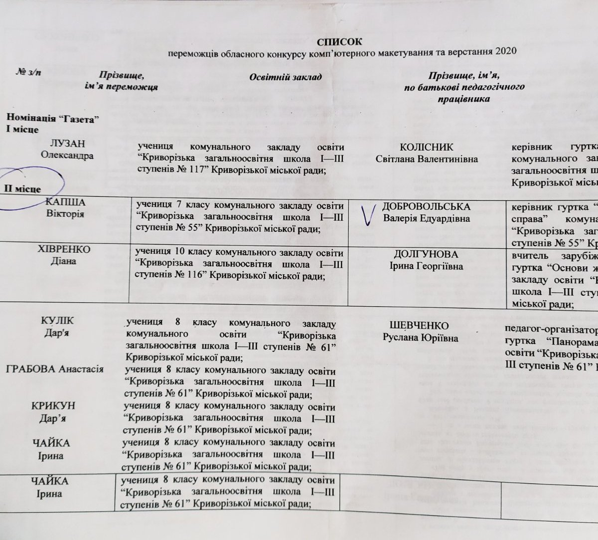

---
title: Обласний конкурс комп’ютерного макетування та верстання 2020
---

Вітаємо ученицю 7 – Б класу КАПШУ ВІКТОРІЮ із зайнятим ІІ місцем в Обласному конкурсі комп’ютерного макетування та верстання 2020 у номінації «Газета».

Усі шкільні видання оцінювались за єдиними критеріями: ідейна спрямованість та актуальність, жанрова різноманітність публікацій, засоби та прийоми подачі матеріалів відповідно до жанру, журналістська майстерність, оформлення та дизайн, регулярність видання газети та журналу.

На конкурс було надано – 1225 робіт зі шкіл більше десяти міст України. Конкуренція була жорсткою, але обізнаність та любов до справи, якою займаєшся, дає можливість піднятися на п’єдестал та посісти призове місце. Молодець!

