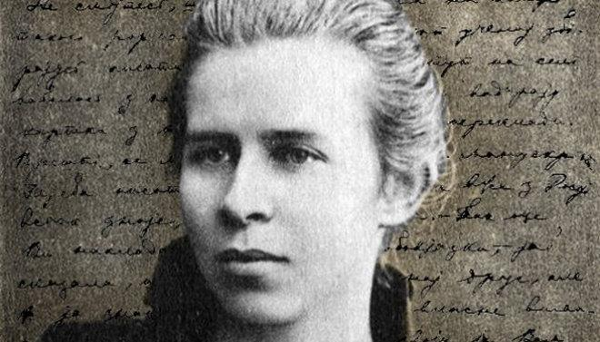

---
title: 150 років від Дня народження Лесі Українки
---

Сьогодні, 25.02.2021р., виповнюється 150 років від Дня народження Лесі Українки - української поетеси, драматурга і громадської діячки, класика української літератури.

Леся Українка — одна з найвизначніших постатей в історії української літератури. По собі вона залишила великий літературний доробок - вражаючі поеми, прозові твори, вірші, публіцистичні статті, переклади світової класики.

Народилася Лариса Косач, саме таким є справжнє ім’я Лесі Українки, 25 лютого 1871 року в місті Новограді-Волинському. Батько її – Петро Косач, був службовцем, мати – Ольга Драгоманова-Косач – письменницею, яка публікувалася під псевдонімом Олена Пчілка.

У будинку Косачів часто збиралися письменники, художники й музиканти, влаштовувалися мистецькі вечори й домашні концерти. Великий вплив на духовний розвиток Лесі Українки мав дядько Михайло Драгоманов, відомий громадський і культурний діяч.

Свій перший вірш – «Надія» – Леся написала дев’ятирічною дівчинкою. Сталося це під враженням від арешту й заслання до Сибіру рідної тітки, Олени Косач, яка належала до київського гуртка «бунтарів». А вже у тринадцять років Ларису Косач почали друкувати. У 1884 році у Львові в журналі «Зоря» опублікували два вірші («Конвалія» і «Сафо»), під якими вперше з’явилось ім’я – Леся Українка. На початку 1893 року у Львові виходить перша збірка поезій поетеси – «На крилах пісень».

Ще в дитячі роки Леся захворіла на туберкульоз, з яким вона боролась усе життя. Хвороба спричинила до того, що дівчинка не ходила до школи, однак завдяки матері, а також Михайлу Драгоманову, вона дістала глибоку і різнобічну освіту. Письменниця знала 11 мов, вітчизняну і світову літературу, історію, філософію.

Побувавши 1891-го року на Галичині, а згодом і на Буковині, Леся познайомилася з багатьма визначними діячами Західної України: Іваном Франком, Михайлом Павликом, Ольгою Кобилянською, Василем Стефаником, Осипом Маковеєм, Наталією Кобринською.

За свої погляди і творчість поетеса перебувала під негласним наглядом поліції, і цензура не раз забороняла її твори. Більшість своїх робіт вона публікувала за кордоном Російської імперії - Берліні, Дрездені, Празі, Відні.

Усе життя Леся Українка була вимушена лікуватися, проходити через болючі медичні процедури, а окрім цього шукати для життя місця, що уповільнювали б розвиток хвороби.

Останні роки Леся Українка жила в Грузії та Єгипті. Разом із чоловіком Климентом Квіткою вона працювала над зібранням фольклору та власними драмами.

Але хвороба прогресувала. На початку липня 1913 року Лесин стан різко погіршився. А 1 серпня 1913 року в грузинському місті Сурамі Леся Українка померла. Її похорони відбулися через кілька днів у Києві на Байковому кладовищі.

З нагоди 150-річчя з Дня народження Лесі Українки в КЗШ №55 КМР ДО проведено ряд заходів та літературознавчих конкурсів. 

Учні 6-В класу разом з класним керівником та вчителем-мовником Харенко Юлею Анатоліївною підготували  та провели урок «Собі ім'я свого народу навіки, як вона, візьми». Учні впевнені, що поетеса стоїть на сторожі нерозмінних вартостей - вічна вчителька національної  етики.

<slideshow id="*6v"></slideshow>

Українська земля породила багатьох письменників і поетів, які не тільки збагатили нашу літературу, але й уславили її серед інших літератур світу. Одне з найвеличніших імен серед них — ім'я Лесі Українки.

І сьогодні, відзначаючи 150 років з Дня народження сильної жінки, учитель української мови та літератури Добровольська Валерія Едуардівна разом з учнями 8-А та 8-Б класів провела літературний вечір «Стояла я і слухала весну».

Поетичний хист Лесі Українки формувався й зміцнювався не лише на величній духовності та героїчній історії свого народу, а й творчому засвоєнні найкращих надбань світової літератури і мистецтва, чому значною мірою сприяли родинні обставини та те інтелігентне оточення, в якому вона перебувала й виховувалася.

Здобувачі освіти представили на розгляд свої стіннівки, присвячені видатній поетесі, та декламували її поезію.

<slideshow id="*8"></slideshow>

9-Б

<youtube id="pRNUSDPhQtI"></youtube>