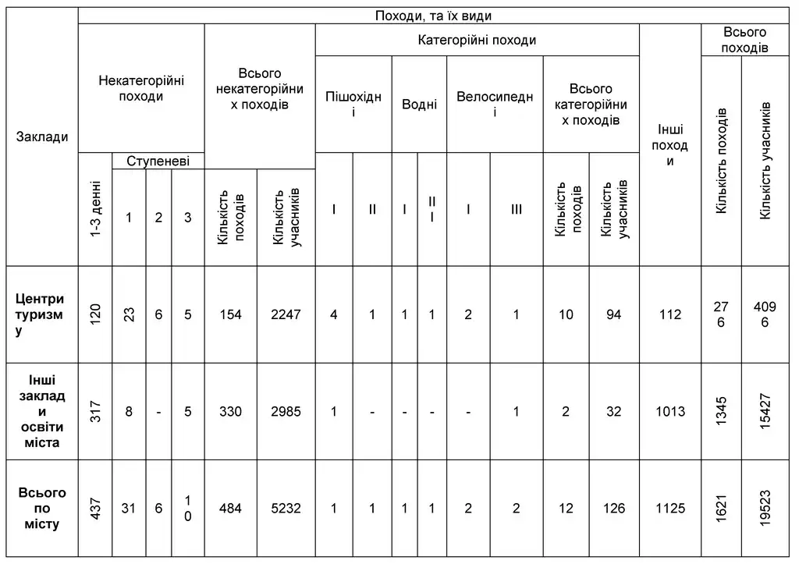
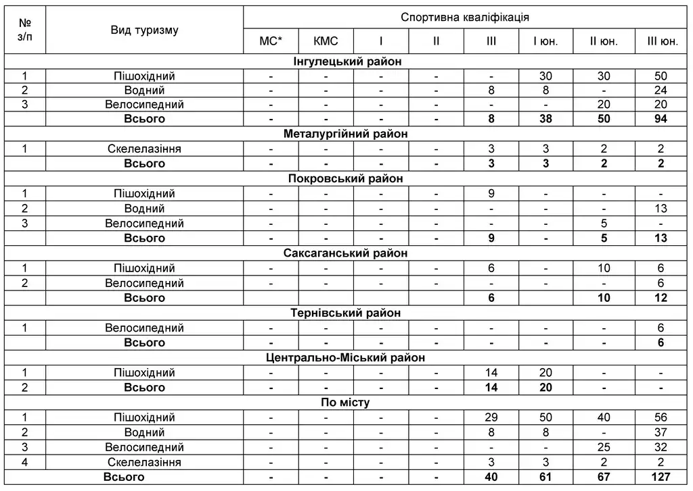

---
title:
    Узагальнена інформація «Про стан розвитку туристсько-краєзнавчої роботи серед
    учнівської молоді м. Кривого Рогу у 2017 році (станом на 31 грудня 2017 року)»
---

Базовими організаційно-методичними осередками розвитку дитячо-юнацького туризму, краєзнавства та національно-патріотичного виховання є профільні позашкільні заклади: КПНЗ «Центр туризму, краєзнавства та екскурсій учнівської молоді Інгулецького району» КМР, КПНЗ «Центр туризму, краєзнавства та екскурсій учнівської молоді «Фортуна» КМР, КПНЗ «Центр туризму, краєзнавства та екскурсій учнівської молоді «Мандрівник» КМР, КПНЗ «Центр туризму, краєзнавства та екскурсій учнівської молоді «Меридіан» КМР, КПНЗ «Центр туризму, краєзнавства та екскурсій учнівської молоді «Вершина» КМР; КПНЗ «Клуб юних моряків» КМР, КПНЗ «Клуб «Юний авіатор» КМР.

Мережа гуртків туристсько-краєзнавчого та військово-патріотичного напрямів в загальноосвітніх та позашкільних навчальних закладах у порівнянні з минулим (2016) роком суттєво не змінилась: кількість гуртків у 2016 році в усіх закладах освіти – 308, а в 2017 – 305. Проте, збільшилась кількість вихованців туристсько-краєзнавчих та військово-патріотичних гуртків в профільних закладах позашкільної освіти. Так, у 2016 році кількість юних туристів-краєзнавців в центрах туризму та центрах патріотичного виховання становила 4291 в 243 гуртках, а в 2017 – 4415 вихованців в 245 гуртках.

Найбільша кількість туристсько-краєзнавчих та військово-патріотичних гуртків у 2017 році працювала у Саксаганському районі (79 – у 2017 році, у порівнянні з 2016 роком - 33), Покровському (63/87), Довгинцівському (43/34), Тернівському (41/62) районах. Найнижчі показники – у Металургійному (29/26), Інгулецькому (27/36) та в Центрально-Міському (23/30) районах.

У центрах туризму, краєзнавства та екскурсій туристсько-краєзнавчою роботою з вихованцями займаються 60 педагогічних працівників (58 у 2016 році), з них: 39 – за основним місцем роботи та 21 – сумісники; мають вищу педагогічну освіту – 58, 1 – отримує вищу педагогічну освіту в даний час, 1 – має вищу освіту спортивного напряму; 2 – нагороджені нагрудним знаком «Відмінник освіти України», 1 – нагрудним знаком «Василь Сухомлинський».

Показниками розвитку туризму та краєзнавства в місті є, як кількість, так і якість проведених змагань з різних видів туризму, туристсько-краєзнавчих зльотів, краєзнавчих конкурсів, вікторин, участь у пошукових експедиціях тощо.

Найактивнішими в організації та підготовці міських масових заходів були КПНЗ «ЦТКЕУМ Інгулецького району» КМР. В даному закладі було організовано та проведено: змагання зі спортивного туризму в закритих приміщеннях, патріотичну квест-гру «Патріот», змагання зі спортивного пішохідного туризму, змагання зі спортивного орієнтування, військово-патріотичну гру «Пластуни». Також були проведені установчі наради з питань організації та участі у зазначених масових заходах. В ході підготовки та проведення усіх туристсько-спортивних масових заходів високий рівень професіоналізму продемонстровано методистом ЦТКЕУМ Інгулецького району Чернявським С.І. Протягом багатьох років вихованці Чернявського С.І. отримували призові місця у змаганнях Всеукраїнського рівня. Визнанням здобутків цього педагога стало вручення йому нагрудного знаку «Василь Сухомлинський».

На базі КПНЗ «ЦТКЕУМ «Фортуна» КМР протягом 2017 року були проведені наступні міські масові заходи: змагання зі спортивного та змагання з паркового орієнтування, змагання зі спортивного туризму для дітей молодшого шкільного віку «Перші старти», перші міські змагання з техніки велотуризму. Якісний організаційно-методичний супровід зазначених заходів та XIII міського зльоту юних туристів-краєзнавців було здійснено методистом КПНЗ «ЦТКЕУМ «Фортуна» КМР Стецуном С.В.

За даними звітів за 2017 рік у місті проведено 865 масових туристсько-краєзнавчих заходів, в яких взяли участь 50375 школярів міста.

Набуті вихованцями у гуртках навички з туризму та краєзнавства використовуються в різноманітних спортивно-туристських та військово-патріотичних заходах, а саме: змаганнях зі скелелазіння, зі спортивного орієнтування серед учнівської молоді, зі спортивного туризму в умовах спортивного залу «Активна зима - 2017», зі спортивного туризму в закритих приміщеннях, зі спортивного орієнтування, з техніки пішохідного туризму, з паркового орієнтування, зі спортивних туристських походів серед учнівської та студентської молоді, у військово-патріотичній грі «Сокіл» («Джура»), у патріотичних іграх «Патріот» та «Козацький квест», під час навчально-тематичних екскурсій Дніпропетровщиною та Україною.

Педагоги загальноосвітніх та позашкільних навчальних закладів районів міста активно використовують найбільш доступну форму туристсько-краєзнавчої роботи з учнівською молоддю – навчально-пізнавальні екскурсії. Протягом 2017 року для учнів закладів загальної середньої та позашкільної освіти міста було проведено 3431 екскурсія по території України (у 2016році – 3383), у яких взяли участь 48041 учень (у 2016 році – 47362 учня), що складає 75,7% від загальної кількості школярів міста.

Цього року учнівська молодь міста брала участь в міських туристсько-краєзнавчих заходах, а саме: міський етап Всеукраїнської експедиції учнівської та студентської молоді «Моя Батьківщина – Україна» (216 учасників), міський етап обласного туристсько-краєзнавчого конкурсу «Золотий Колобок-2017» (288), міський етап Всеукраїнської туристсько-краєзнавчої експедиції з активним способом пересування «Мій рідний край» (72 учасника), ХІІІ міський зліт юних туристів-краєзнавців «Моя земля – земля моїх батьків» (112 учасників), міське патріотичне віче «Об’єднані любов’ю до Батьківщини» (650 учасників). У 2017 році в місті Кривий Ріг з 20 лютого по 18 травня проходила міська акція «Виховуємо нащадків патріотів», в рамках акції було проведено 8 міських заходів, а саме: патріотичне віче «Об’єднанні любов’ю до Батьківщини», літературний конкурс, присвячений 72-ій річниці Великої Перемоги, військово-патріотична квест-гра «Патріот», конкурс екскурсійних маршрутів «Стежками героїзму та гідності», конкурс на кращу пошукову роботу «Герої поруч з нами», виставка малюнків «Сивочолі ветерани – визволителі Кривого Рогу», конкурс відеороликів-привітань ветеранів. Дана акція об’єднала загалом 15506 учнів та вихованців закладів загальної середньої та позашкільної освіти.

В травні 2017 року команда від міста Кривого Рогу під керівництвом вчителя Криворізької загальноосвітньої школи №44 Покровського району Маханько І.В. була однією з представників Дніпропетровської області на ІІ Міжнародній дитячій туристичній виставці «З любов’ю до Батьківщини в Європейській спільноті». В даному заході команда нашого міста показали високий рівень підготовки та посіли почесне І місце.

Аналіз участі та результативності учнів та вихованців закладів загальної середньої та позашкільної освіти у конкурсах різних рівнів свідчить про високу активність Довгинцівського району, незважаючи на відсутність центру туризму в цьому районі. Завдяки роботі гуртка «Літературне краєзнавство» Криворізької педагогічної гімназії, керівником якого є Богоманова І.В., в районі активно розвивається туристко-краєзнавчий напрям виховної роботи. Вихованці гуртка стали переможцями багатьох міських конкурсів та змагань. У грудні 2017 року на обласних змаганнях з орієнтування команда КПГ під керівництвом Богоманової І.В. посіла ІІІ місце серед закладів загальної середньої освіти.

Розвиток туристсько-краєзнавчої роботи здійснюється в музеях навчальних закладів, що має великий виховний вплив під час навчального процесу та у позаурочний час. Всього у навчальних закладах міста діють 45 музеїв. В січні 2017 року юні екскурсоводи музеїв закладів освіти та їх керівники взяли участь у обласному етапі Всеукраїнського конкурсу екскурсоводів музеїв «Край, в якому я живу». Завдяки постійній підтримці та високому Сорочинської Н.М. (керівник музею КЗШ №90) та Булгакової В.А. (керівник музею КГ №91) професіоналізму під час підготовки до конкурсу, переможцем став юний екскурсовод етнографічного музею КЗШ №90 Довгинцівського району Гусейнов Алі, який представляв Дніпропетровщину в місті Києві, де і зайняв почесне друге місце.

Кількість здійснених походів, їх географія, категорійність, проведення туристських змагань, підготовка педагогічних кадрів, участь в очно-заочних районних, міських, обласних, Всеукраїнських масових заходах з учнівською молоддю свідчать про достатній рівень розвитку туристсько-спортивних гуртків.

У 2017 році у загальноосвітніх та позашкільних навчальних закладах міста працювало 78 туристсько-спортивних гуртків, в яких навчалося 1780 вихованців (у 2016 році - 85 гуртків, 1717 вихованців). Цей факт вказує на збільшення кількості груп туристсько-спортивних гуртків, відповідно на збільшення кількості гуртківців.

Кількість категорійних походів значно зменшилась у період з 2013 року в зв’язку з нестабільною і суперечливою геополітичною ситуацією на території України.

Однією з найактивніших форм роботи з гуртківцями є проведення туристських походів ріднокраєм.

Згідно звітів, наданих керівниками центрів туризму, краєзнавства та екскурсій учнівської молоді було проведено 1621 похід, залучено 19523 учасники, з них 12 категорійних з 126 учасниками (в 2015 році було проведено 1494 походів з 17984 учасниками, з них 6 категорійних з 95 учасниками). В даному пункті звіту туристсько-краєзнавчої роботи простежується збільшення кількості походів, в тому числі категорійних, та відповідно збільшення кількості залучених до них учнів та вихованців закладів освіти міста.

За підсумками участі у спортивних змаганнях і проведених спортивно-туристських походах у 2017 році 295 вихованцям спортивно-туристських гуртків міста були присвоєні наступні розряди за видами туризму (у 2017 році – 435):

Найбільша кількість спортсменів-розрядників з пішохідного, водного, спортивного туризму підготовлено КПНЗ «ЦТКЕУМ Інгулецького району» КМР (190), КПНЗ «ЦТКЕУМ «Вершина» КМР (34), КПНЗ «ЦТКЕУМ «Мандрівник» КМР (28), КПНЗ «ЦТКЕУМ «Фортуна» КМР (27), в закладах освіти Металургійного району (10), КПНЗ «ЦТКЕУМ «Меридіан» КМР (6). Порівняно з минулим роком, спортсменів-розрядників підготували менше, проте в 2017 році в кожному центрі туризму є вихованці, які отримали туристсько-спортивні розряди та заклади загальної середньої освіти Металургійного району.

За даними звітів, у центрах туризму, краєзнавства та екскурсій учнівської молоді працюють 60 педагогічних працівників, з яких 3 мають звання «Майстер спорту»; 1 – «Кандидат в майстри спорту»; 7 - мають перший спортивний розряд; 3 – другий спортивний розряд; 6 – третій спортивний розряд; інструктор з туризму - 2; інструктор з дитячо-юнацького туризму – 18; керували походами І категорії складності – 15, ІІ категорії – 15, ІІІ категорії – 5, ІV та V категорії – 3; не мають туристської кваліфікації – 23.

Курсову підготовку за фахом у 2017 році пройшли педагоги закладів освіти міста у КВНЗ «Дніпропетровський обласний інститут післядипломної педагогічної освіти»:

-   інструктор дитячо-юнацького туризму –4 педагога;
-   методисти багатопрофільних позашкільних закладів освіти – 11 педагогів.
