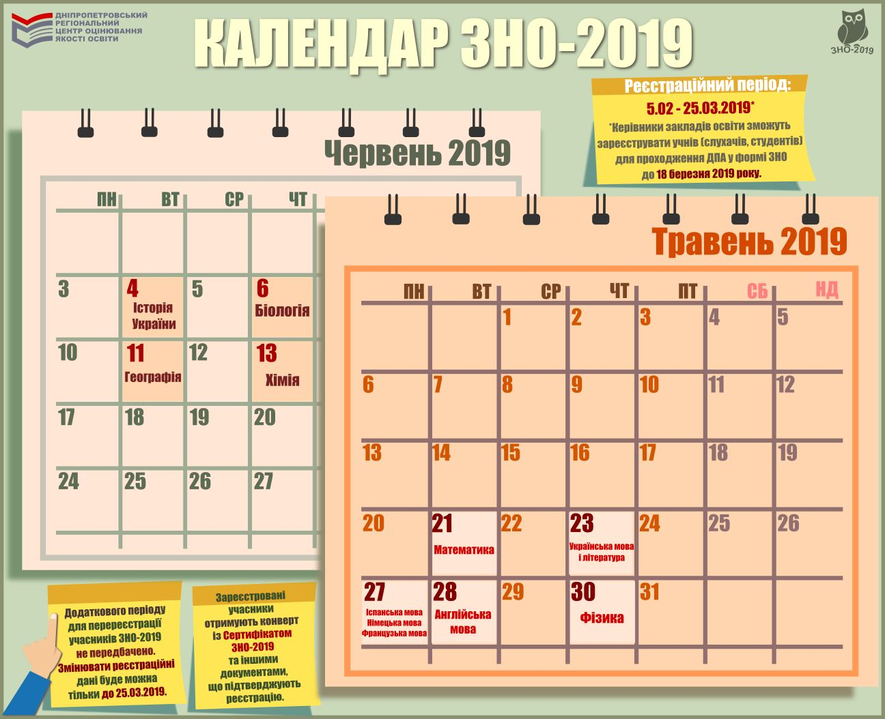

[Наказом](http://testportal.gov.ua//wp-content/uploads/2018/10/Kalendarnyj-plan_2019.pdf) Міністерства освіти і науки України від 28 вересня 2018 року № 1036 затверджено календарний план підготовки та проведення зовнішнього незалежного оцінювання 2019 року.

Відповідно до наказу реєстрація осіб для участі у зовнішньому незалежному оцінюванні триватиме з 5 лютого до 25 березня 2019 року. Керівники закладів освіти зможуть зареєструвати учнів (слухачів, студентів) для проходження ДПА у формі ЗНО до 18 березня 2019 року.

Звертаємо увагу на те, що додаткового періоду для перереєстрації учасників зовнішнього незалежного оцінювання 2019 року не передбачено. Тож змінювати реєстраційні дані можна буде тільки до 25 березня 2019 року.

До 30 квітня 2019 року зареєстровані учасники зможуть завантажити зі своїх інформаційних сторінок запрошення-перепустки, де буде зазначено час і місце проведення тестувань.

Основна сесія зовнішнього незалежного оцінювання почнеться 21 травня тестуванням з математики і завершиться 13 червня тестуванням з хімії. Тестування з української мови і літератури відбудеться 23 травня, з іспанської, німецької, французької мов — 27 травня, з англійської мови — 28 травня, з фізики — 30 травня, з історії України — 4 червня, з біології — 6 червня, з географії — 11 червня.

Інформацію про результати основної сесії зовнішнього незалежного оцінювання з усіх навчальних предметів буде розміщено на інформаційних сторінках учасників тестування до 25 червня 2019 року. Результати зовнішнього незалежного оцінювання з математики, української мови і літератури та фізики буде оголошено до 14 червня, з іноземних мов та біології — до 20 червня, з історії України, географії, хімії — до 25 червня.

Реєстрація для участі в додатковій сесії зовнішнього незалежного оцінювання окремих категорій осіб, які не мали змоги зареєструватися в основний період (зокрема, учасники антитерористичної операції, особи з окупованого Криму та непідконтрольних Україні територій Донбасу), триватиме з третього до 20-го травня 2019 року. Графік проведення додаткової сесії зовнішнього незалежного оцінювання буде оприлюднено до 30 квітня 2019 року. Результати зовнішнього незалежного оцінювання учасники додаткової сесії отримають до 18 липня.

