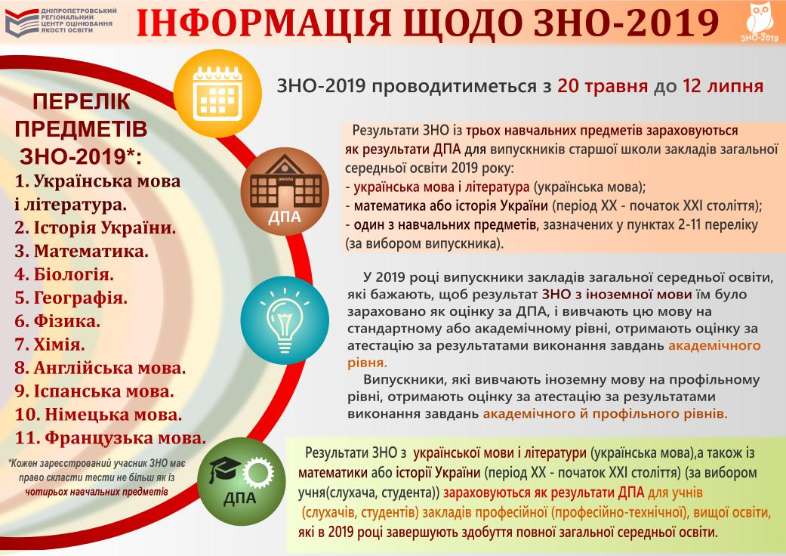

[Наказом](https://ips.ligazakon.net/document/view/re32482?an=1) Міністерства освіти і науки України від 22 серпня № 931 врегулювано проведення зовнішнього незалежного оцінювання 2019 року.

Відповідно до наказу кожен зареєстрований учасник має право пройти тести щонайбільше з чотирьох навчальних предметів. Загалом зовнішнє незалежне оцінювання відбуватиметься з одинадцяти навчальних предметів: українська мова і література, історія України, математика, біологія, географія, фізика, хімія, англійська мова, іспанська мова, німецька мова, французька мова.

Випускникам старшої школи закладів загальної середньої освіти 2019 року результати зовнішнього незалежного оцінювання з трьох навчальних предметів буде зараховано як результати державної підсумкової атестації. Ці учасники мають обов’язково скласти:

- українську мову і літературу;
- математику або історію України (на вибір учасника);
- ще один предмет з переліку (історія України, математика, біологія, географія, фізика, хімія, англійська мова, іспанська мова, німецька мова, французька мова).

У 2019 році випускники закладів загальної середньої освіти, які бажають, щоб результат зовнішнього незалежного оцінювання з іноземної мови їм було зараховано як оцінку за державну підсумкову атестацію, і вивчають цю мову на стандартному або академічному рівні, отримають оцінку за атестацію за результатами виконання завдань академічного рівня. Випускники, які вивчають іноземну мову на профільному рівні, отримають оцінку за атестацію за результатами виконання завдань академічного й профільного рівнів.

Варто наголосити, що 2019 року зовнішнє незалежне оцінювання з української мови і літератури, а також математики або історії України (період ХХ – початок ХХІ століття) (на вибір) проходитимуть учні (слухачі, студенти) закладів професійної (професійно-технічної), вищої освіти, які 2019 року завершать здобуття повної загальної середньої освіти. Таким учасникам результати тестування буде зараховано як оцінки за державну підсумкову атестацію за освітній рівень повної загальної середньої освіти.

