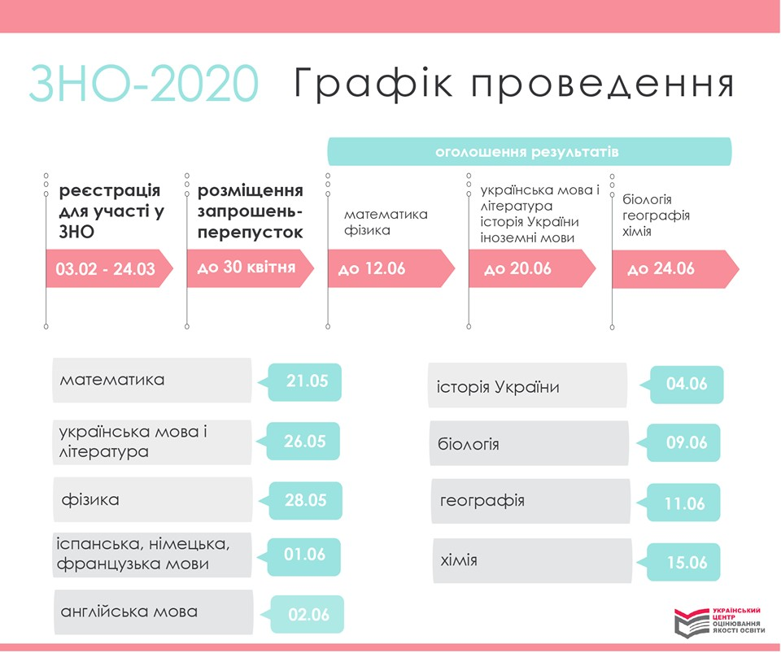

---
title: Терміни проведення ЗНО-2020
---

[Наказом Міністерства освіти і науки України від 9 липня 2019 року № 947](http://testportal.gov.ua/wp-content/uploads/2019/07/Nakaz-MON-947-vid-09-07-2019.pdf) затверджено календарний план підготовки та проведення зовнішнього незалежного оцінювання 2020 року.

Відповідно до наказу реєстрація осіб для участі у зовнішньому незалежному оцінюванні триватиме з 3 лютого до 24 березня 2020 року. Керівники закладів освіти зможуть зареєструвати учнів (слухачів, студентів) для проходження ДПА у формі ЗНО до 17 березня 2020 року.

До 30 квітня 2020 року зареєстровані учасники зможуть завантажити зі своїх інформаційних сторінок запрошення-перепустки, де буде зазначено час і місце проведення тестувань.

Основна сесія зовнішнього незалежного оцінювання почнеться 21 травня тестуванням з математики і завершиться 15 червня тестуванням з хімії. Тестування з української мови і літератури відбудеться 26 травня, з фізики — 28 травня, з іспанської, німецької, французької мов — 1 червня, з англійської мови — 2 червня, з історії України — 4 червня, з біології — 9 червня, з географії — 11 червня.

Інформацію про результати основної сесії зовнішнього незалежного оцінювання з усіх навчальних предметів буде розміщено на інформаційних сторінках учасників тестування до 24 червня 2020 року.

Зміст сертифікаційних робіт відповідатиме програмам зовнішнього незалежного оцінювання, затвердженим наказами Міністерства освіти і науки України від 26 червня 2018 року №696, від 20 грудня 2018 року № 1426.

