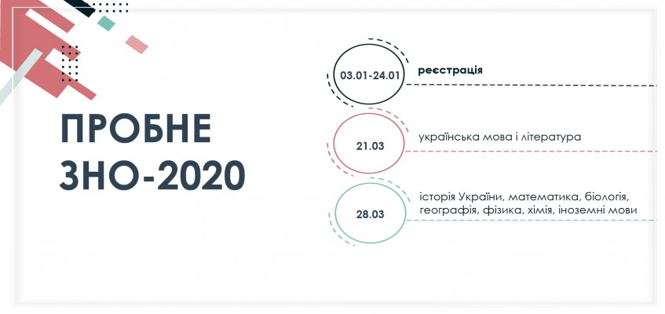

---
title: Пробне ЗНО-2020
---

Що я знаю з певного предмета, який у мене рівень підготовки, скільки тестових балів я можу набрати під час ЗНО, над чим мені потрібно ще попрацювати… На ці та інші запитання щороку випускники закладів освіти задовго до ЗНО можуть отримати відповідь під час пробного зовнішнього незалежного оцінювання.

Участь у пробному тестуванні дає можливість учасникам попрацювати з тестами, що відповідають вимогам Програм, характеристикам і структурі сертифікаційних робіт основної сесії зовнішнього незалежного оцінювання 2020 року, попрактикуватися в заповненні бланків відповідей, психологічно налаштуватися на проходження зовнішнього незалежного оцінювання та навчитися ефективно розподіляти час.

Реєстрація для участі у пробному ЗНО триватиме **з 3 до 24 січня 2020 року**. Зареєструватися можна буде [на сайтах](http://testportal.gov.ua/regions/) регіональних центрів оцінювання якості освіти.

Пробне ЗНО з української мови і літератури відбудеться **21 березня**, з історії України, математики, біології, географії, фізики, хімії, іноземних мов (англійської, іспанської, німецької та французької) — **28 березня**. У день проведення пробного тестування кожний зареєстрований учасник може пройти тест з одного навчального предмета.

Пробне зовнішнє незалежне оцінювання є платною послугою для учасників та неприбутковою для організаторів і проводиться за кошти фізичних і юридичних осіб. Вартість одного тестування для одного учасника буде оголошено **до 11 грудня** сайтах регіональних центрів оцінювання якості освіти.

[Детальніше](http://testportal.gov.ua/probzno/)
